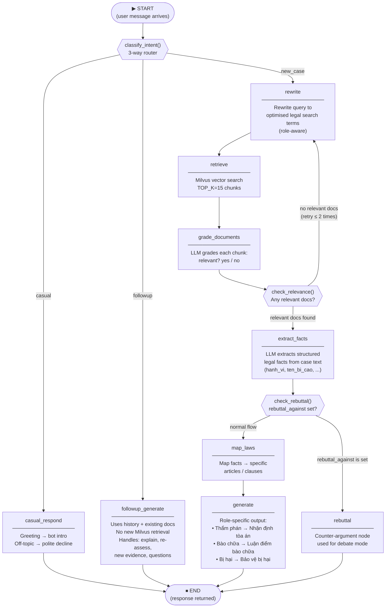

# AI Service — LangGraph Flow

## Full Graph



---

## Log Output Per Path

When a message is processed you will see these lines in the log:

### Path 1 — Casual / Greeting
```
  [INTENT] → casual | query='hi'
[NODE: casual_respond]
```

### Path 2 — Follow-up / Elaboration
```
  [INTENT] → followup | query='Giải thích thêm điểm 3...'
[NODE: followup_generate]
```

### Path 3 — New Case (full pipeline, no rebuttal)
```
  [INTENT] → new_case | query='Bị cáo Nguyễn Văn A tàng trữ...'
[NODE: rewrite]
[NODE: retrieve]
  [RAG] Retrieved 15 chunks:
    ID=1346  score=0.6106  | Chương: XX  Điều: 249
    ...
[NODE: grade_documents]
[NODE: extract_facts]
  Facts: ['hanh_vi', 'ten_bi_cao', ...]
  Sentencing data: {'detention_months': 5.1, ...}
[NODE: map_laws]
[NODE: generate]
```

### Path 3b — New Case with Rebuttal
```
  [INTENT] → new_case | query='...'
[NODE: rewrite]
[NODE: retrieve]
[NODE: grade_documents]
[NODE: extract_facts]
[NODE: rebuttal]
```

---

## State Fields

| Field | Type | Set by |
|-------|------|--------|
| `question` | `str` | `/predict` endpoint |
| `full_case_content` | `str` | `/predict` endpoint |
| `user_role` | `"neutral"\|"defense"\|"victim"` | `/predict` endpoint |
| `chat_history` | `List[{role, content}]` | `/predict` endpoint |
| `rebuttal_against` | `str\|None` | `/predict` endpoint |
| `documents` | `List[Document]` | `retrieve` node |
| `extracted_facts` | `Dict` | `extract_facts` node |
| `mapped_laws` | `List[Dict]` | `map_laws` node |
| `sentencing_data` | `Dict` | `extract_facts` node |
| `messages` | `List[BaseMessage]` | All terminal nodes |
| `retry_count` | `int` | `check_relevance` edge |
